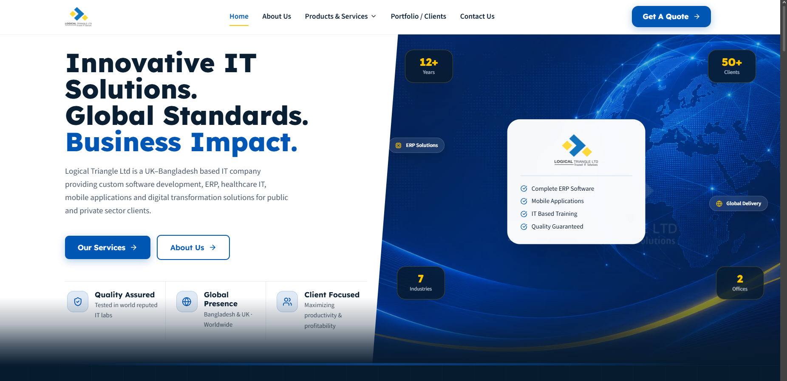
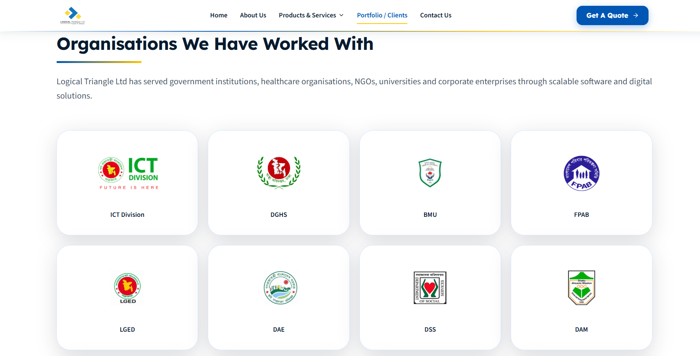
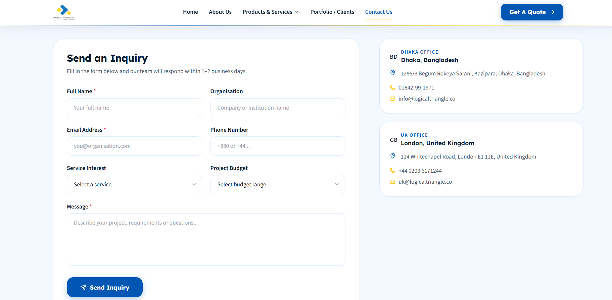

# Logical Triangle Frontend

A modern, high-performance frontend application developed for **Logical Triangle Ltd. (LTC)**. The platform presents LTC’s technology services, software solutions, organizational identity, client-facing communication channels, and professional digital presence through a responsive, production-ready web interface.



---

## Live Website

[Visit Logical Triangle Website](https://logicaltriangle.co/)

---

## Repository

[GitHub Repository](https://github.com/Meherab-32816/ltc)

---

## Overview

The **Logical Triangle Frontend** is a professional web application built with **Next.js**, **React**, **TypeScript**, and **Tailwind CSS**. It is designed to represent Logical Triangle Ltd. as a modern IT and software solutions company, with a clean user interface, responsive layout, optimized performance, and structured content presentation.

The platform supports service discovery, company positioning, portfolio presentation, contact flow, and client-facing communication. It follows modern frontend development practices including component-based architecture, type-safe implementation, reusable UI patterns, SEO-friendly structure, and deployment-ready configuration.

The project was developed with emphasis on:

* professional technology-company branding
* responsive and accessible frontend design
* clear service and product presentation
* optimized performance
* maintainable component architecture
* secure form handling
* production deployment readiness

---

## Website Screenshots

### Homepage


### Services Section


### Products / Solutions Section


### Portfolio / Clients Section



### Contact Section



### Mobile View


---

## Key Features

| Area                | Description                                                                                |
| ------------------- | ------------------------------------------------------------------------------------------ |
| Homepage            | Professional landing page for LTC’s digital identity                                       |
| Services            | Structured presentation of IT, software, ERP, web, mobile, training, and digital solutions |
| Products            | Dedicated product and service pages for major offerings                                    |
| Portfolio / Clients | Client-facing section for credibility and previous work                                    |
| Contact             | Inquiry and communication pathway for potential clients                                    |
| Responsive Design   | Optimized layouts for desktop, tablet, and mobile                                          |
| SEO Readiness       | Metadata, semantic structure, and social-sharing friendly configuration                    |
| Type Safety         | Full TypeScript implementation                                                             |
| Form Validation     | Zod-based validation for structured user input                                             |
| Email Handling      | Nodemailer integration for inquiry delivery                                                |
| Production Build    | Deployment-ready Next.js configuration                                                     |

---

## Core Website Sections

### Home

Introduces Logical Triangle Ltd. as a technology and software solutions company with a modern digital identity and clear positioning.

### Services

Presents the company’s major service areas, including custom software development, ERP systems, IT-based training, web development, mobile applications, healthcare IT, LMS, telemedicine, and digital solutions.

### Products and Solutions

Highlights specialized software products and service offerings through dedicated content pages.

### Portfolio and Clients

Supports institutional credibility by presenting previous clients, work areas, and technology delivery experience.

### Contact

Provides a structured pathway for potential clients, partners, and stakeholders to submit inquiries.

---

## Technology Stack

| Layer         | Technology                                          |
| ------------- | --------------------------------------------------- |
| Framework     | Next.js 16.2.6                                      |
| UI Library    | React 19.2.4                                        |
| Language      | TypeScript 5                                        |
| Styling       | Tailwind CSS 4.3.0                                  |
| Icons         | Lucide React 1.16.0                                 |
| Validation    | Zod 4.1.5                                           |
| Email Service | Nodemailer 6.10.1                                   |
| Linting       | ESLint 9                                            |
| Runtime       | Node.js                                             |
| Deployment    | VPS / DigitalOcean / Vercel-compatible Node hosting |

---

## Code Composition

| Language / Layer | Share |
| ---------------- | ----- |
| TypeScript       | 95.7% |
| CSS              | 3.2%  |
| Other            | 1.1%  |

---

## System Architecture

```txt
User
 │
 ▼
Next.js Frontend Application
 │
 ├── Homepage
 ├── Services pages
 ├── Product and solution pages
 ├── Portfolio and client pages
 ├── Contact interface
 └── SEO/social metadata

Frontend Layer
 │
 ├── React components
 ├── Tailwind CSS styles
 ├── TypeScript types
 ├── Responsive layouts
 └── Reusable UI sections

Server/API Layer
 │
 ├── Contact form route
 ├── Zod validation
 ├── Nodemailer integration
 └── Environment-variable-based configuration
```

---

## Project Structure

```txt
ltc/
├── app/
│   ├── page.tsx
│   ├── about-us/
│   ├── contact/
│   ├── portfolio-clients/
│   └── products-services/
│
├── components/
│   ├── layout/
│   ├── sections/
│   └── ui/
│
├── lib/
│   ├── site-data/
│   ├── validation/
│   └── utilities/
│
├── public/
│   ├── assets/
│   └── images/
│
├── styles/
│
├── package.json
├── tsconfig.json
├── eslint.config.js
├── tailwind.config.ts
└── postcss.config.js
```

---

## System Requirements

| Requirement     | Version          |
| --------------- | ---------------- |
| Node.js         | 18.17.0 or later |
| npm             | 9.0.0 or later   |
| Recommended npm | 10.2.4           |

---

## Getting Started

### Install Dependencies

```bash
npm install
```

### Start Development Server

```bash
npm run dev
```

The application will be available at:

```txt
http://localhost:3000
```

---

## Production Build

### Build Application

```bash
npm run build
```

### Start Production Server

```bash
npm start
```

### Start with Custom Port

```bash
PORT=8000 npm run start:prod
```

---

## Available Scripts

| Command              | Description                                  |
| -------------------- | -------------------------------------------- |
| `npm run dev`        | Start development server with hot reload     |
| `npm run build`      | Create optimized production build            |
| `npm start`          | Run production server on port 3000           |
| `npm run start:prod` | Run production server with configurable port |
| `npm run lint`       | Run ESLint checks                            |
| `npm run lint:fix`   | Automatically fix linting issues             |
| `npm run type-check` | Perform TypeScript type checking             |
| `npm run clean`      | Remove build artifacts and cache             |
| `npm run analyze`    | Analyze bundle size                          |
| `npm run export`     | Build static export                          |

---

## Environment Configuration

Create a `.env.local` file in the project root when using email or contact form features.

```env
CONTACT_RECEIVER_EMAIL="info@example.com"
CONTACT_SENDER_EMAIL="no-reply@example.com"
SMTP_HOST="smtp.example.com"
SMTP_PORT="587"
SMTP_USER="your-smtp-user"
SMTP_PASSWORD="your-smtp-password"
NODE_ENV="development"
```

For production deployment, configure secrets through the hosting provider’s environment variable panel. Never commit `.env.local` or production credentials to GitHub.

---

## Contact Form and Validation

The project includes structured contact form handling with:

* server-side validation
* Zod schema checks
* Nodemailer email delivery
* protected environment variables
* safe production configuration
* structured error handling

Recommended production protections:

* honeypot field
* rate limiting
* safe error messages
* SMTP credential protection
* no API keys or secrets in client-side code

---

## Performance Optimization

The application includes performance-focused implementation patterns:

* Next.js automatic code splitting
* optimized production builds
* static generation where applicable
* responsive image handling
* reusable component architecture
* Tailwind utility-first styling
* bundle analysis support
* minimized client-side overhead where possible

Recommended checks before deployment:

```bash
npm run lint
npm run type-check
npm run build
```

---

## Deployment

The project can be deployed on:

* DigitalOcean Droplet
* Hostinger VPS
* Vercel
* Node.js-compatible cloud platforms
* Nginx reverse proxy environments

### Recommended VPS Production Setup

```txt
Next.js Application
 │
PM2 Process Manager
 │
Nginx Reverse Proxy
 │
HTTPS via Certbot
 │
Domain DNS Configuration
```

### Basic VPS Deployment Flow

```bash
# Clone repository
git clone https://github.com/Meherab-32816/ltc.git

cd ltc

# Install dependencies
npm install

# Build application
npm run build

# Start production server
npm start
```

For PM2 deployment:

```bash
npm install -g pm2
pm2 start npm --name "ltc" -- start
pm2 save
pm2 startup
```

---

## Nginx Reverse Proxy Example

```nginx
server {
    listen 80;
    server_name logicaltriangle.co www.logicaltriangle.co;

    location / {
        proxy_pass http://localhost:3000;
        proxy_http_version 1.1;
        proxy_set_header Upgrade $http_upgrade;
        proxy_set_header Connection 'upgrade';
        proxy_set_header Host $host;
        proxy_set_header X-Real-IP $remote_addr;
        proxy_set_header X-Forwarded-For $proxy_add_x_forwarded_for;
        proxy_set_header X-Forwarded-Proto $scheme;
        proxy_cache_bypass $http_upgrade;
    }
}
```

Enable HTTPS:

```bash
sudo apt install certbot python3-certbot-nginx
sudo certbot --nginx -d logicaltriangle.co -d www.logicaltriangle.co
```

---

## Production Checklist

* [ ] `npm run lint` passes
* [ ] `npm run type-check` passes
* [ ] `npm run build` passes
* [ ] Environment variables configured
* [ ] Contact form tested
* [ ] Images optimized
* [ ] Metadata verified
* [ ] Social sharing preview tested
* [ ] Mobile layout tested
* [ ] Domain configured
* [ ] HTTPS enabled
* [ ] PM2 or hosting process manager configured
* [ ] No secrets committed to GitHub

---

## Security Considerations

The application should follow production security practices:

* keep secrets in environment variables
* never expose SMTP credentials in frontend code
* validate contact form input server-side
* use safe error messages
* configure rate limiting for contact routes
* avoid committing `.env.local`
* keep dependencies updated
* use HTTPS in production
* protect deployment server access with SSH keys

---

## Development Best Practices

This project follows modern frontend development practices:

* type-safe development with TypeScript
* reusable component architecture
* clear folder structure
* consistent linting
* responsive-first styling
* environment-based configuration
* production build validation
* scalable content and section organization

---

## Screenshots Folder

To render screenshots correctly in this README, add images using this structure:

```txt
screenshots/
  ltc-homepage.png
  ltc-services.png
  ltc-products.png
  ltc-portfolio-clients.png
  ltc-contact.png
  ltc-mobile-view.png
```

Recommended screenshot settings:

```txt
Width: 1200px to 1600px
Format: PNG or JPG
File size: under 1 MB each
```

---

## My Role

I contributed to the development and refinement of the Logical Triangle frontend platform with focus on frontend implementation, responsive layout improvement, production readiness, contact flow, deployment preparation, and professional presentation.

Key contribution areas included:

* frontend layout improvement
* service and product section organization
* responsive design refinement
* navigation and user experience improvement
* contact form structure and validation
* deployment-readiness support
* performance and build checks
* technical documentation

---

## Outcome

The Logical Triangle Frontend provides a professional digital presence for LTC and supports client-facing communication for software, IT, digital transformation, and technology consulting services.

It demonstrates practical frontend engineering, component-based UI development, responsive design, production deployment awareness, and professional web application delivery.

---

## License

This project is private and maintained by **Meherab-32816**.

All company branding, content, and visual identity belong to **Logical Triangle Ltd.**

---

## Maintainer Note

Before production deployment or major updates, always verify:

```bash
npm run lint
npm run type-check
npm run build
```

Also update this README whenever major routes, service pages, deployment settings, or contact-form configurations change.

---

## Version

**Version:** 1.0.0
**Repository:** https://github.com/Meherab-32816/ltc
